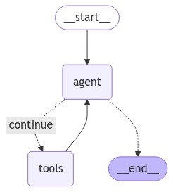
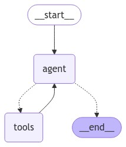

# Project Name

4-ReAct-Agent-with-langgraph-and-tavily

https://langchain-ai.github.io/langgraphjs/tutorials/quickstart/

## Description

This project demonstrates the use of Langchain's React Agent with
Langgraph for building interactive AI applications. It showcases two
approaches:

### Basic Approach (src/1.basic.ts)

Creates a basic React Agent using prebuilt components.
Retrieves weather information with Tavily Search and responds with a
ChatOpenAI model.
Saves the agent's state graph for visualization.

### State Graph Workflow (src/2.agent.ts)

Defines a custom state graph workflow for more control over agent
interactions.
Uses a Tavily Search tool node and a ChatOpenAI model for weather queries.
Allows for conditional branching based on whether tool calls are made.
Visualizes the state graph.

## Requirements

Node.js and npm (or yarn) installed
Langchain dependencies specified in package.json

## Installation

Clone this repository.

Install dependencies: npm install (or yarn install)

## Usage

To run the basic example:

`npm run basic`

To run the state graph workflow example:

`npm run agent`

## File Descriptions

### src/1.basic.ts

Imports necessary Langchain components and utilities.
Defines agent tools (Tavily Search) and the ChatOpenAI model.
Creates a memory saver for the agent's state.
Constructs the React Agent with the tools, model, and checkpoint saver.
Retrieves the agent's state graph as a Mermaid PNG image and saves it.

Simulates a conversation about weather in San Francisco and New York,
including tool calls and model responses.



### src/2.agent.ts

Imports Langchain components and utilities.
Defines Tavily Search tools and binds them to a tool node.
Creates a ChatOpenAI model linked to the tool node.
Implements a shouldContinue function to check for tool calls in the state.
Defines a callModel function to process states using the model.

Constructs a state graph workflow with nodes, edges, and conditional
branching.
Compiles the workflow into an application.
Retrieves the state graph image and saves it.

Simulates a conversation about weather in San Francisco.



## Additional Notes

Replace placeholders in .env with your API keys or credentials.

```
OPENAI_API_KEY=<>
TAVILY_API_KEY=<>
```
