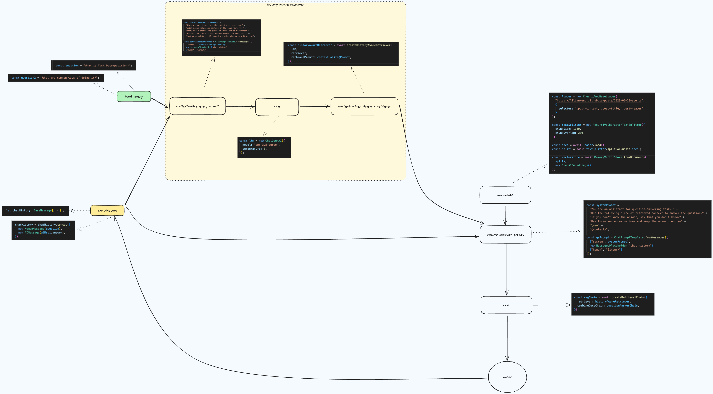

### Conversational RAG System

#### Overview

This JavaScript project implements a Conversational Retrieval-Augmented
Generation (RAG) system using [LangChain](https://www.langchain.com/) and
[OpenAI](https://openai.com/) APIs. It retrieves content from external
sources, processes it into vector embeddings, and supports multi-turn,
context-aware conversations for question-answering tasks.

https://js.langchain.com/docs/tutorials/qa_chat_history

#### Features

- **Context-Aware QA**: Uses vector embeddings to provide contextual
  answers based on user input.
- **Memory-Persistent Conversations**: Stores conversation history to
  retain context for follow-up questions.
- **Flexible Prompt Customization**: Templates for prompt customization to
  adjust LLM behavior.
- **Streaming Support**: Streams responses for real-time interaction.
- **Agent Execution**: Runs agents to retrieve and process information
  using various LangChain tools.

#### Project Structure

```plaintext
src/
├── 1-basic.ts                       # Basic conversational RAG pipeline
├── 2-chat-history.ts                # Chat history-aware RAG system
├── 3-runnable-with-message-history.ts  # Runs RAG pipeline with message history persistence
├── 4-stream.ts                      # Streaming response for continuous interactions
├── 5-agent.ts                       # RAG agent for task decomposition with retriever tool
└── libs/
    └── index.ts                     # Utility for logging agent messages
package.json                         # Scripts and dependencies
```


